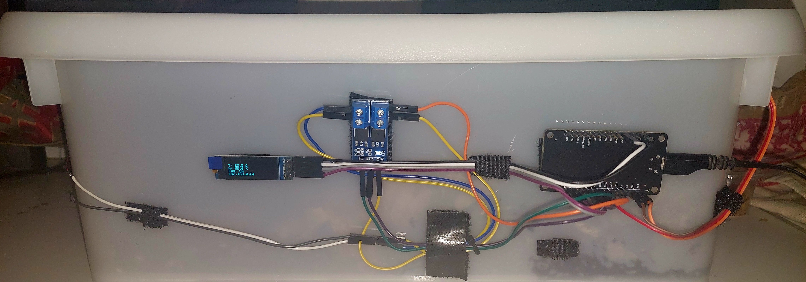
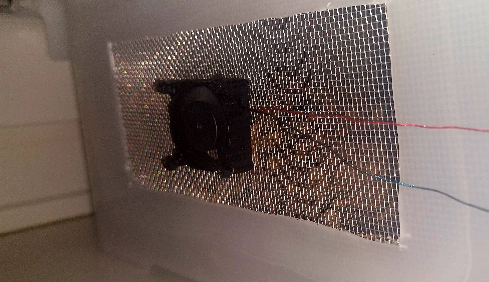
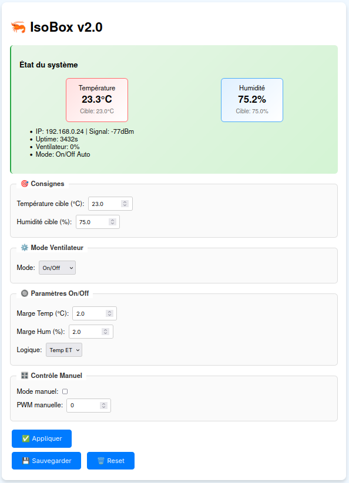

# 🌡️ Contrôle Température / Humidité avec ESP8266 + OLED

Ce projet permet de lire la température et l'humidité via un capteur **DHT22**, d'afficher les données sur un écran **OLED SSD1306 (128x32)**, de contrôler un ventilateur (ON/OFF) en fonction des seuils définis, et de configurer les consignes à distance via une **interface web embarquée**.

## 🔧 Matériel requis

- ESP8266 (NodeMCU, Wemos D1 Mini…)
- DHT22 (capteur de température et d’humidité)
- Écran OLED SSD1306 (I2C, 128x32)
- Ventilateur (commandé via un GPIO, ici `D5`)
- Connexion Wi-Fi

## ⚙️ Fonctionnalités

- Lecture de la température et humidité chaque seconde
- Affichage des valeurs sur OLED avec IP locale
- Contrôle du ventilateur selon consignes + marges
- Interface web pour modifier les seuils à la volée

## 🌐 Interface Web

Accès via l’adresse IP du module (affichée sur l’écran).  
Formulaire simple permettant de modifier :

- Température cible et marge
- Humidité cible et marge

## 📦 Bibliothèques utilisées

- `ESP8266WiFi`
- `ESP8266WebServer`
- `DHT`
- `Adafruit_GFX`
- `Adafruit_SSD1306`
- `Wire`

## 📁 Fichiers

Tout est contenu dans un seul fichier `.ino`, prêt à être flashé depuis l’IDE Arduino.

## 🔒 Remarques

- Les identifiants Wi-Fi sont définis en dur dans le code (`ssid`, `password`).
- Aucun stockage permanent des réglages n’est implémenté pour l’instant (non persistant après redémarrage).
